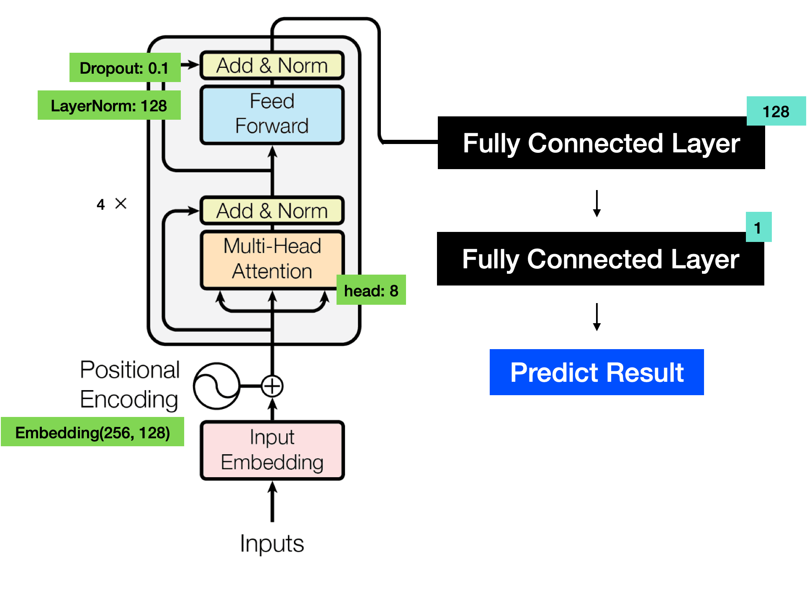
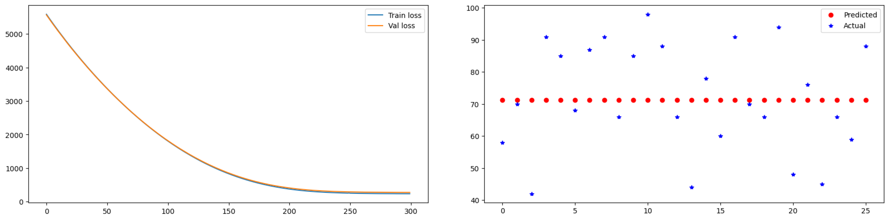
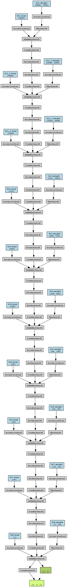
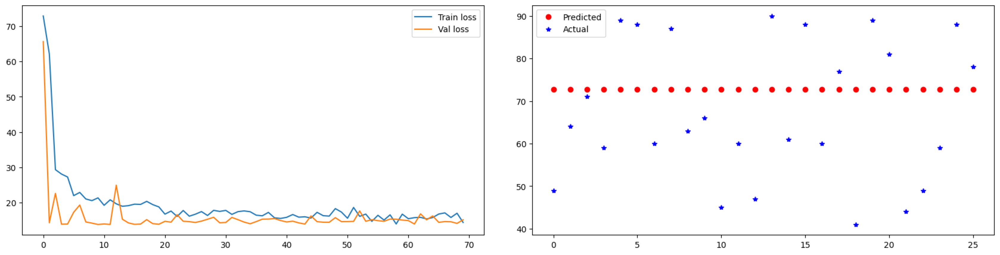
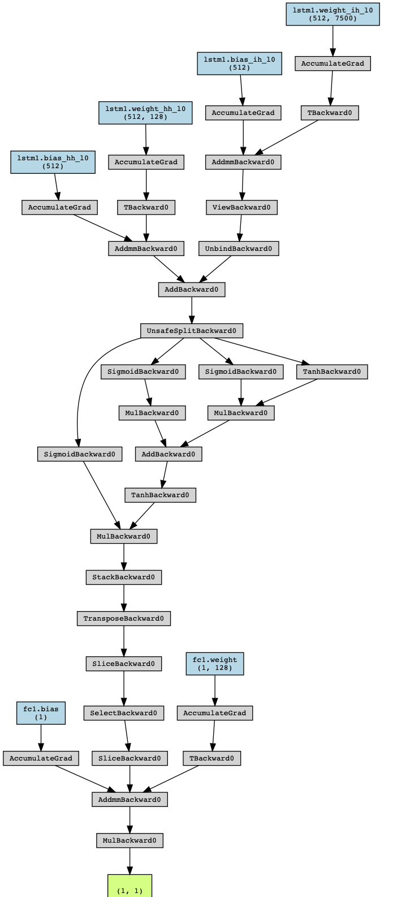
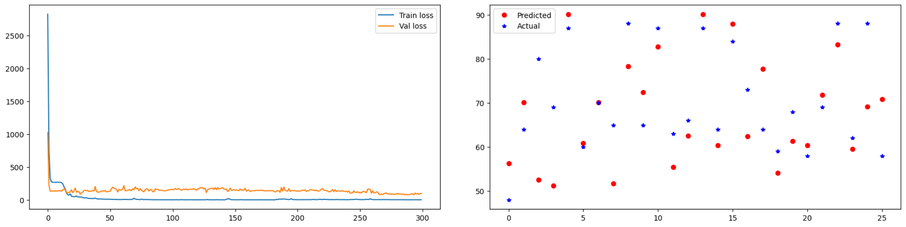

# Deep Learning Approaches for Estimate Steps from RAW ECG Signals

Our project aims to estimate walking steps from raw electrocardiogram (ECG) signals obtained from wearable devices. Wearable devices with IMUs are commonly used to monitor physical performance during these activities. Additionally, other studies have investigated walking at different speeds and inclines, as well as climbing stairs, to better understand human locomotion.

For more detailed information, please refer to the [PAPER.md](./PAPER.md) file.

# Result

## Transformer Encoder + Fully Connected Model

The left side shows the Train Loss and Validation Loss, while the right side displays the output of the predictions. From the output, one can assess whether the actual values and predicted values align vertically, indicating successful results, or if the data points that are vertically aligned are close to each other, suggesting effectiveness. When observing the results of the Transformer Encoder + Fully Connected Layer, it can be seen that the loss decreases beautifully. However, it appears that the model may have become trapped in a local minimum or that the training was insufficient.

## Deep Fully Connected Model

<!--  -->

Based on the results, it is evident that the Fully Connected Layer Model has indeed become trapped in a local minimum. This can be observed by the consistent convergence of the loss towards 20. Therefore, it can be concluded that it is challenging to obtain accurate results using this model.

## LSTM + Fully Connected Layer Model

<!--  -->

I believe the model that yielded the best results was the one where I focused on reducing the model's size and prolonging the training process to increase accuracy. In reality, the model achieved a Train Loss convergence close to 0, although the Validation Loss did not decrease further due to overfitting or getting stuck in a local minimum. However, compared to other models, this one produced the best prediction results.

In conclusion, I learned that increasing the complexity and size of the model does not necessarily lead to higher accuracy. Instead, I found that keeping the model lightweight and allowing for longer training durations can result in better overall accuracy.